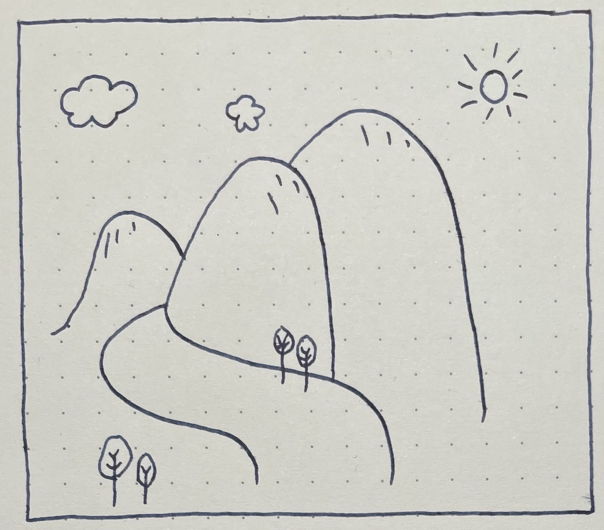
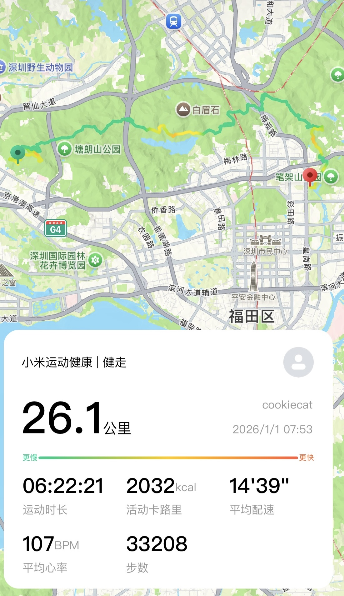
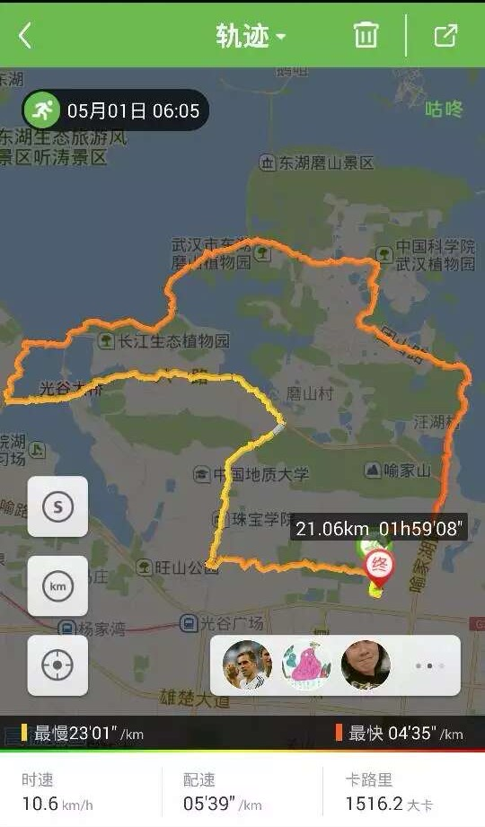
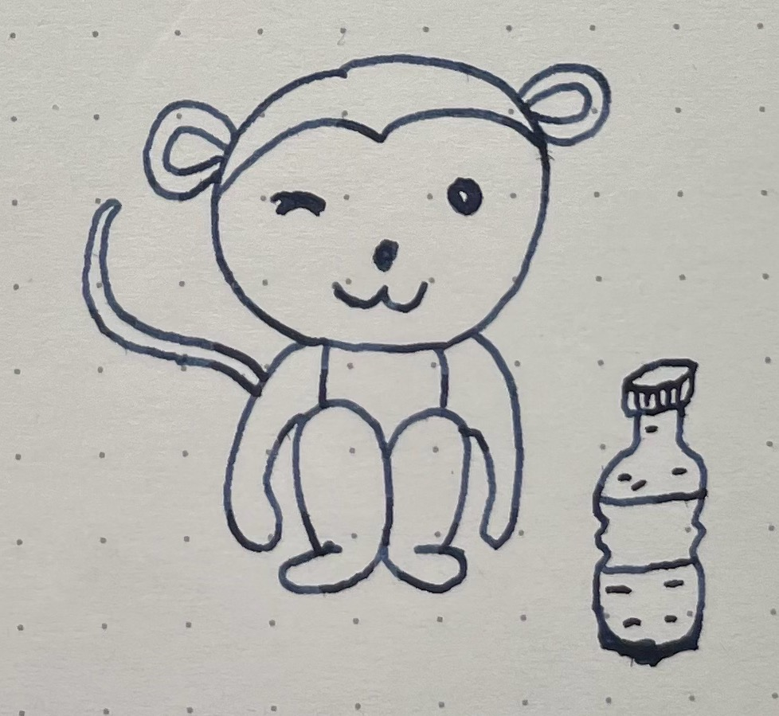
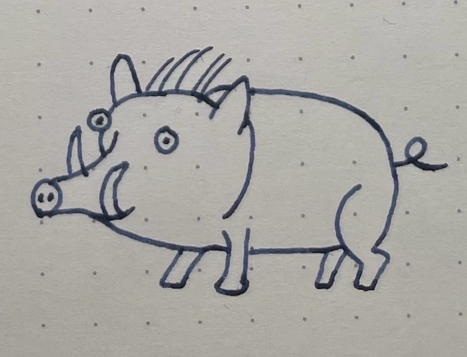
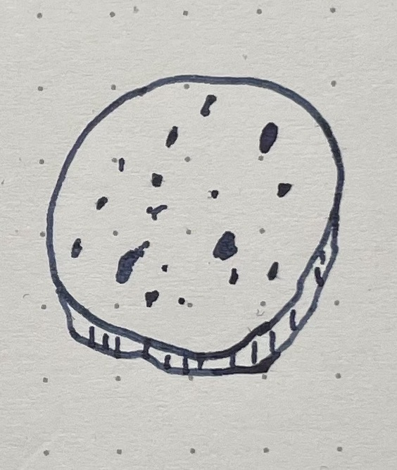
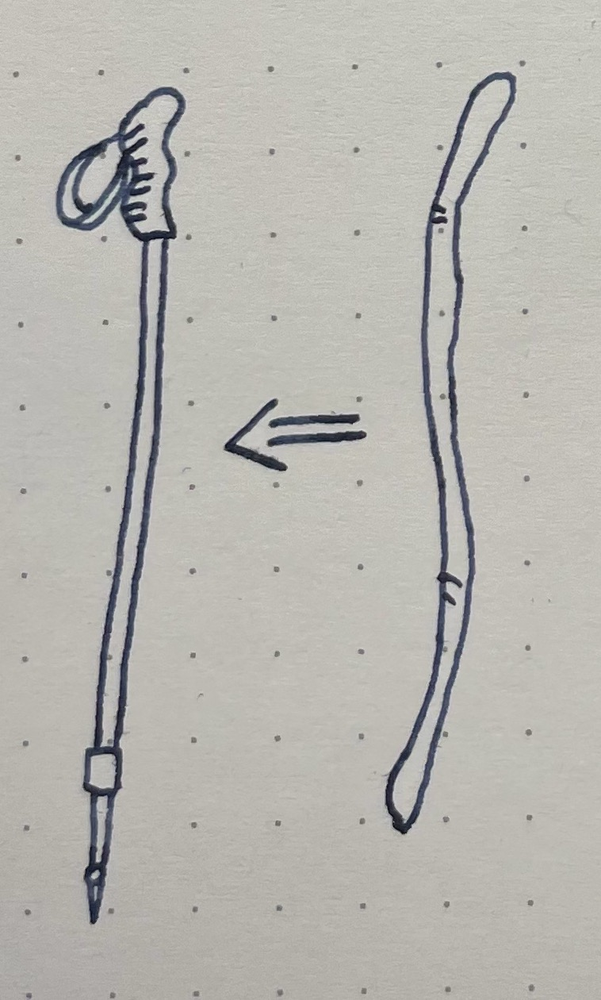

Title: 元旦徒步
Date: 2025-01-01 23:30  
Category: 运动  
Summary: 新年的第一天，沿着深圳鲲鹏径徒步路线走一走，爬爬山，晒晒太阳，感受大自然。
Url: 2026/01/01/hiking-of-2026-new-years-day.html

> 远距离爬山，没有登山杖是真不行，找了一路，终于找到了最满意的一根棍子，作为登山杖，拄着它，帮助我走完了二十多公里的山路。

新年的第一天，阳光明媚，气温宜人，非常适合户外活动，穿一件卫衣刚刚好，不需要穿外套，这一天开启了我的深圳鲲鹏径徒步之旅。全程走了26公里，从塘朗山出发，途径梅林山、银湖山，最终到达笔架山公园的终点。

上次一口气运动超过20公里，还是十年前在武汉上大学时，有一天突然想跑步跑远一点，于是说干就干，就早起，绕着武汉东湖跑了一圈，21公里，刚好一个半程马拉松的距离。

塘朗山的小动物真是多，走着走着一抬头，看到前面有几只小猴子，不知道从哪里抢了一瓶矿泉水，正在舔流到地上的水。我蹲下去想给其中的一只拍照片，它却非常生气，朝着我呲牙，想要来打我，吓得我赶紧跑。

在路边的草丛里，还看到一只野猪妈妈在带着小野猪觅食。

在爬山的过程中，观察到一种有趣的现象：只要遇到有拐弯的路，就一定有一条抄近道的小路被踩出来，这可能叫做——"最小阻力之路"。

爬到了山顶上，会看到有一些无人值守的卖水点，水就摆在箱子里，箱子上贴了支付二维码和价格清单，可以自觉扫码支付买水。

背了一个书包，装的喝的和吃的非常充足，在又累又热的状态下，喝一口水，吃一块奥利奥夹心饼干真是非常惬意，这饼干是这次带的最满意的东西之一。但是需要注意的是，最好不要在走的过程中喝水，容易被呛着。

一路上吃了很多东西，但没有带垃圾袋，垃圾只能装在书包里一直背着。

这次装备准备得不太充足，穿的鞋不太合脚，鞋底太硬，磨得脚掌疼，不太适合爬山，还好脚没有被磨破。在前面几公里，密集爬很陡的山，发现缺少一样东西：登山杖，登山杖在上山的时候可以辅助省劲，下山的时候可以缓冲走得更平稳，于是边走边留意地上有没有树枝、棍子可以拿来当登山杖，陆续找到了几根，最终选择了一根最合适的棍子，长度、形状、粗细、手感都非常好，拄着它走完了剩下的二十多公里。

一根普通的棍子，山上到处都是这种棍子，但是我手里的这一根，和其他的就不一样了，它参与了我这段二十多公里的旅程，把它拿回了家，坐地铁的时候发现这根破棍子和地铁的现代化环境格格不入，但是没关系，没有人care。

回到家在棍子的把手位置用电钻钻了一个孔，绑上一根像正规登山杖那样的手环，更接近于一根真正的登山杖了。
